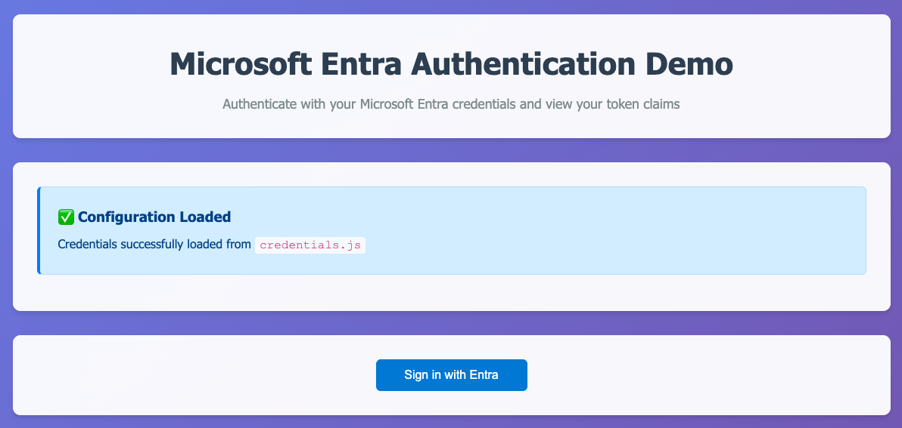

**🤖 AI-Generated Project**

This project was created using AI assistance from **GitHub Copilot** powered by **Claude Opus 4** and **Sonnet 4** models. The entire codebase, documentation, and implementation plan were generated through AI collaboration.

---

# Microsoft Entra Authentication Demo

A simple single-page application that demonstrates Microsoft Entra (formerly Azure AD) authentication using MSAL.js library and displays the token claims, including claims provided by Entra Authentication Extensions.

## Features

- **Microsoft Entra Authentication**: Users can sign in with their Microsoft Entra credentials
- **Token Claims Display**: Shows all ID token claims after successful authentication
- **Access Token Display**: Displays the acquired access token
- **Responsive Design**: Works on both desktop and mobile devices
- **Error Handling**: Comprehensive error handling for authentication failures

## Screenshot



*The application interface before authentication*

## Prerequisites

Before running this application, you need to:

1. **Microsoft Entra Tenant**: Access to a Microsoft Entra tenant
2. **App Registration**: Register an application in Microsoft Entra

## Azure Setup Instructions

### 1. Register Application in Microsoft Entra

1. Go to the [Entra Admin Portal](https://entra.microsoft.com)
2. Navigate to **App registrations**
3. Click **New registration**
4. Fill in the application details:
   - **Name**: Choose a name for your application (e.g., "Entra Demo App")
   - **Supported account types**: Choose based on your needs
   - **Redirect URI**: Select "Single-page application (SPA)" and enter your URL (e.g., `http://localhost:3000` for local development)
5. Click **Register**

### 2. Configure Application Settings

After registration:

1. Note the **Application (client) ID** and **Directory (tenant) ID**
2. Go to **Authentication** section:
   - Ensure your redirect URI is listed
   - Under **Implicit grant and hybrid flows**, check **ID tokens**
3. Go to **API permissions**:
   - Ensure these permissions are granted:
     - `User.Read` (Microsoft Graph)
     - `openid`
     - `profile`
     - `email`

### 3. Configure Credentials

1. **Copy the example credentials file:**
   ```bash
   cp credentials.example.js credentials.js
   ```

2. **Update credentials.js with your Azure app details:**
   ```javascript
   const credentials = {
       clientId: "your-actual-client-id-here",
       tenantId: "your-actual-tenant-id-here"
   };
   ```

   Replace:
   - `your-actual-client-id-here` with your **Application (client) ID**
   - `your-actual-tenant-id-here` with your **Directory (tenant) ID**

3. **Important**: The `credentials.js` file is automatically ignored by git to keep your sensitive information secure.

## Local Development

### Method 1: Using Python (if installed)

```bash
# Navigate to the project directory
cd EntraDisplayTokenClaims

# Start a simple HTTP server
python3 -m http.server 8000

# Open your browser to http://localhost:8000
```

### Method 2: Using Node.js (if installed)

```bash
# Install a simple HTTP server
npm install -g http-server

# Navigate to the project directory and start server
cd EntraDisplayTokenClaims
http-server -p 8000

# Open your browser to http://localhost:8000
```

### Method 3: Using Live Server Extension in VS Code

1. Install the "Live Server" extension in VS Code
2. Right-click on `index.html` and select "Open with Live Server"

## How It Works

1. **Authentication Flow**: Uses OAuth 2.0/OpenID Connect flow via MSAL.js
2. **Token Acquisition**: Acquires both ID tokens and access tokens
3. **Claims Display**: Parses and displays all claims from the ID token
4. **Security**: Uses MSAL.js for secure token handling and storage

## File Structure

```
entra-dempo/
├── index.html              # Main HTML page
├── screenshot.png          # Example screenshot
├── auth.js                 # Authentication logic using MSAL.js
├── config.js               # MSAL configuration
├── credentials.example.js  # Example credentials file (safe to commit)
├── credentials.js          # Your actual credentials (ignored by git)
├── styles.css              # Styling
└── README.md               # This file
```

## Security Considerations

- **HTTPS**: Use HTTPS in production environments
- **Token Storage**: Tokens are stored in session storage by default
- **Redirect URIs**: Ensure redirect URIs are properly configured in Azure
- **Scopes**: Only request necessary scopes for your application

## Troubleshooting

### Common Issues

1. **Configuration Missing**: If you see a warning about configuration, ensure you've created `credentials.js` from `credentials.example.js`
2. **CORS Errors**: Ensure you're serving the files from a web server, not opening directly in browser
3. **Redirect URI Mismatch**: Verify the redirect URI in Azure matches your development URL
4. **Credentials Not Loading**: Make sure `credentials.js` exists and has valid clientId and tenantId values

### Error Messages

The application includes comprehensive error handling that will display specific error messages for common authentication issues.

## Resources

- [MSAL.js Documentation](https://docs.microsoft.com/en-us/azure/active-directory/develop/msal-js-initializing-client-applications)
- [Microsoft Entra Documentation](https://docs.microsoft.com/en-us/azure/active-directory/)
- [Microsoft Graph API](https://docs.microsoft.com/en-us/graph/)